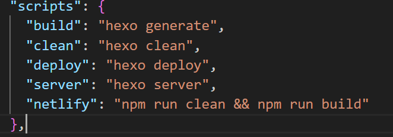

引言：博客是一项用于记录学习心得，生活趣事，吐槽奇葩现象的工具，它对于学习计算机的同学而言，更是有着十分重要的意义。
-----------------------------------------------------------------------------------
注：本文所说的指令皆在cmd中操作
-----------------------------------------------------------------------------------

##     1.环境准备：

​            在正式搭建博客网站之前，需要做好环境的配置。我们需要安装[nodejs]([Node.js — 在任何地方运行 JavaScript](https://nodejs.org/zh-cn))，可以通过官网进行下载安装完成以后可以通过以下两行指令查看版本信息
​            `node -v`
​            `npm -v`

##     2.框架安装：

​            接下来我们就可以进行hexo框架的安装了，只需要输入下面这行指令
​            `npm install hexo-cli -g`

​            然后我们需要创建本地仓库，也就是在计算机本地存放博客的文件夹，我的位置是建议在我的文档这个文件夹下创建这个文件夹，命名为myblog或者任一你喜欢的名字。现在我们就可以输入下面这行指令了
​            `hexo init "你的博客目录名称"` 
​            接着我们需要进入博客目录
​            `cd "你刚刚创建的博客的位置"` 
​            接着安装其他支持
​            `npm install`
​            到这里我们的博客网站已经基本构建完成
​            输入以下代码进行本地浏览：
​            `hexo g`
​            `hexo s`
​            进入http://localhost:4000就可以预览你现在的博客啦。

##     3.布署上线

​            首先进入到你的博客的文件夹中找到package.json这个文件，用vscode打开它（记事本打开会导致缩进问题，不详谈）然后找到scripts这一段内容，"hexo server"后面添加一个,号，换行然后再加入下面这段代码
​            `"netlify": "npm run clean && npm run build"`

完成以后如下所示

​            之后我们就可以设置GitHub的托管服务了，登入你的GitHub账号，然后创建本地仓库，点击code，记录下你的HTTP地址。

然后输入下面这行代码
            `cd "本地博客位置"`
            `git init`
            `git add .`
            `git commit -m "blog"`
            `git remote add origin "刚刚记下的地址"`
            `git branch -M main`
            `git push -u origin main`

​            我们需要用到[Netlify](https://www.netlify.com/)，如果登不上就用一下梯子根据指引建立网站，连接到GitHub，选择你刚创建的仓库，在**Build command**这一栏改成**npm run netlify**其他可以默认。

然后我们可以得到我们的网站了，接下来我们需要解决域名和CDN问题

##       4.DNS加速

​	   我们需要购买一个域名，阿里云，腾讯云上都可以购买得到，有了域名之后，我们就对他进行解析，类型选择CNAME，内容就是xxxx.netlify.app，xxxx就是你在netlify设置的。设置完成之后，我们等待半个小时左右，DNS需要同步。

这是我设置好的：

​            经过一段时间的等待过后，回到Netlify网站，找到Domain management，选择add domain，如果一切正常，在第二步add DNS record会自动配置，不需要操作，如果没有说明你的DNS可能还没有同步，那就再等待一会时间再进行该操作。

​		

​		到这里我们的网站其实已经完成了上线，只不过无法在国内访问。因此我们就需要CDN加速，使用[Cloudflare](https://www.cloudflare.com/zh-cn/)就是一种免费而且方便的方案。

​            进入[Cloudflare](https://www.cloudflare.com/zh-cn/)，注册，登入，输入你购买的域名，输入你购买的域名，输入你购买的域名，输入你刚刚购买的域名，这很重要别输成你刚刚做的网站的网址了，选择免费套餐，接着你就可以根据指引完成这项工作了。设置完成以后再回到Netlify的HTTPS界面，去取得网站的证书，一般来说Netlify会在设置完成以后自动取得证书，不过这也需要一定时间的等待。

##     5.完结撒花

​       	到这里你已经完成了所有步骤，相信你也成功搭建起了自己的博客网站。

